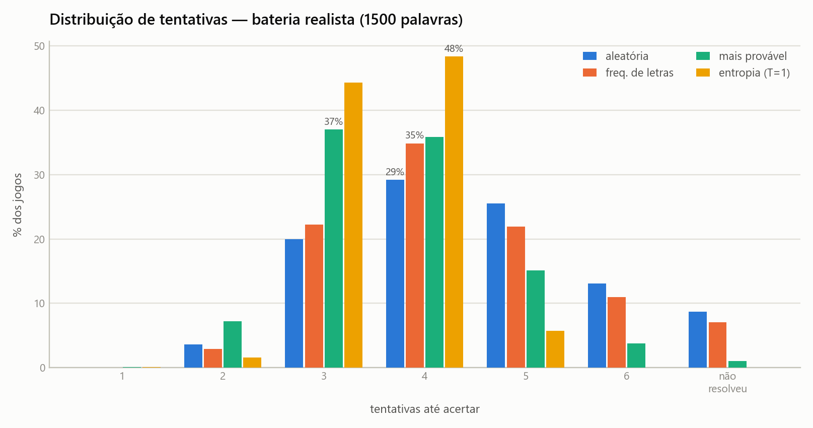
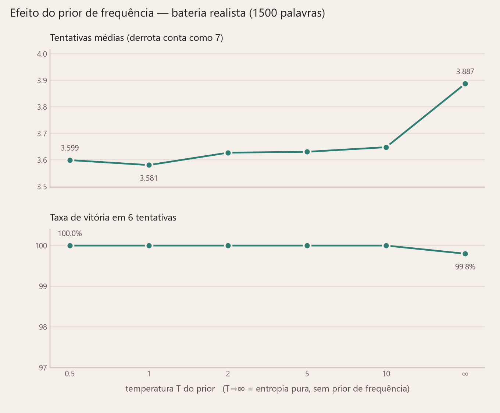
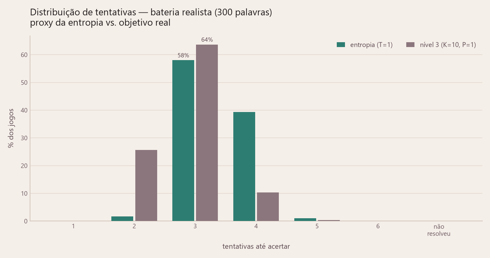

<p align="center">
  
</p>

<h1 align="center">Destermo</h1>
<p align="center"><i>O palpite ótimo do Termo.</i></p>

Solver de [Termo](https://term.ooo) escrito em Python. Duas frentes, como manda a
[especificação v1.1](docs/ESPECIFICACAO_v1.1.md): uma **ferramenta** — CLI que
sugere a próxima palavra — e uma **análise** — benchmark que mede quanto cada
ideia do algoritmo realmente vale, em tentativas. A
[v1.0](docs/ESPECIFICACAO_v1.0.md) fica no histórico porque os resultados das
duas são comparados aqui embaixo.

O solver **nunca conhece a palavra secreta**. Ele mantém o conjunto de palavras
ainda compatíveis com todo o feedback recebido e escolhe a jogada que minimiza
quantas tentativas ainda faltam.

---

## Como o solver pensa

Esta seção é a espinha do projeto: três níveis de algoritmo, cada um corrigindo
um erro do anterior. Tudo que vem depois — código, benchmark, resultados — é
consequência dela.

### O estado do jogo é um conjunto

O Termo dá 6 tentativas para achar uma palavra de 5 letras. Cada tentativa volta
com 5 cores: 🟩 letra certa no lugar certo, 🟨 letra existe fora do lugar,
⬛ letra não existe.

Toda a informação de uma partida cabe num conjunto:

> **C** = as palavras do léxico que produziriam *exatamente* o feedback visto até
> agora.

`C` começa com as 6.046 palavras do léxico e só encolhe. Manter `C` é a parte
fácil, e não é onde os solvers erram: basta reusar a mesma função de feedback do
jogo e ficar com quem bate ([`termo/feedback.py`](termo/feedback.py)).

A pergunta difícil é a outra: **qual palavra jogar agora?** Os três níveis são
três respostas para ela.

### Nível 1 — frequência de letras

*"Jogue a palavra com as letras mais comuns entre as candidatas."*

É a heurística intuitiva e é o que a maioria dos solvers de Termo por aí faz. No
benchmark ela resolve 92,9% das partidas em 4,17 tentativas: melhor que chutar ao
acaso, e pouco mais que isso.

O furo é que **letra comum não é informação**. Uma palavra pode ter cinco letras
frequentíssimas e ainda assim deixar 300 candidatas de pé, se todas elas
responderem com o mesmo padrão de cores. A heurística otimiza a palavra jogada;
o que importa é o que ela faz com o conjunto.

### Nível 2 — entropia

O que interessa é como a jogada **divide** `C`. Uma tentativa `g` particiona o
conjunto em até 243 grupos (3⁵ padrões de cores possíveis): cada candidata cai no
grupo do padrão que ela devolveria. Se um grupo concentra quase tudo, a jogada
quase não informa; se os grupos saem pequenos e parecidos entre si, ela informa
muito.

Isso é exatamente a entropia de Shannon da partição:

```
p(padrão) = massa das candidatas que responderiam esse padrão / massa total
H(g)      = -Σ p · log₂ p                                          [bits]
```

Joga-se o `g` de maior `H`. Duas sutilezas que valem tentativas:

- **O espaço de jogadas é o léxico inteiro**, não só `C`. Vale "queimar" uma
  tentativa numa palavra que não pode ser a resposta, se ela separar melhor.
- **`H` mede a partição inteira**, então `g` é avaliado contra todas as
  candidatas de uma vez. Fazer isso 6.046 vezes por jogada é o que exige a matriz
  de padrões pré-computada ([`termo/matriz.py`](termo/matriz.py)).

### O prior: nem toda candidata é igualmente provável

O Termo sorteia `festa`, não `leruê`. As duas estão no léxico; só uma vai cair de
verdade. O arquivo `icf` do [`fserb/pt-br`](https://github.com/fserb/pt-br) dá o
**Inverse Corpus Frequency** de cada palavra (score baixo = palavra comum), e ele
vira um peso:

```
prior(w) = softmax(-ICF(w) / T)
```

`T` é um dial contínuo entre os dois primeiros níveis:

| T | o que acontece |
|---|---|
| T → 0 | corte quase binário: só as palavras mais comuns têm peso |
| **T = 1** | **padrão do projeto** |
| T → ∞ | pesos iguais — recupera a entropia pura, sem prior |

O prior entra pesando as **candidatas** dentro de `H`; ele nunca restringe quais
jogadas testar. Medido no benchmark, vale **0,31 tentativa**.

### Nível 3 — o objetivo real

Aqui está o pulo do gato, e é a correção que o 3Blue1Brown publicou depois da
lição original: **bits são um proxy, não o objetivo.** O jogo não premia
informação, premia acabar cedo — e as duas coisas divergem. A jogada que mais
separa costuma ser uma palavra que *não pode ser a resposta*, ou seja, uma que
garantidamente não encerra a partida naquela rodada.

O nível 3 otimiza o número esperado de tentativas, diretamente:

```
V(S, r) = min_g [ 1 + Σ_{padrão ≠ GGGGG} P(padrão | S) · V(S_padrão, r-1) ]
V(S, 0) = 7        acabaram as rodadas sem acertar
```

Em voz alta: *jogar `g` custa 1 tentativa; nos casos em que não acerto, herdo o
sub-conjunto correspondente e sigo jogando bem a partir dali.*

O `r` — rodadas restantes — não é decoração. Sem ele o solver otimiza um jogo de
tentativas ilimitadas e cai na espiral clássica do Termo, `prima → urina → brida
→ crica → criva`: cinco candidatas prováveis que se distinguem por uma letra só.
Cada jogada dessas maximiza a chance de acertar *agora*, o valor esperado adora
isso, e a partida acaba na 7ª. Com o limite na recursão a busca enxerga a parede
e gasta uma jogada separando o grupo.

Tomada de frente, a recursão é intratável. Três coisas a domam — e a primeira é a
mais bonita:

- **beam** — só os `K` palpites de maior entropia entram na busca em cada nó. Ou
  seja: **o nível 2 vira o *move ordering* do nível 3.** O proxy não era inútil;
  o erro era tomá-lo como resposta final.
- **profundidade** — abaixo de `P` níveis a recursão cai na política gulosa do
  nível 2. Como uma política concreta é sempre um limite *superior* de `V`, o
  valor só melhora quando `P` cresce: a busca é *anytime*, e `P=0` com `beam=1`
  reproduz o próprio nível 2.
- **memoização + poda** — os mesmos estados reaparecem muito, e a soma parcial só
  cresce, então um palpite é abandonado no meio assim que passa do melhor custo já
  encontrado no nó.

### Os três lado a lado

| nível | escolhe por | 1.500 palavras | 300 palavras |
|---|---|---|---|
| 1 — freq. de letras | letras mais comuns em `C` | 4,171 | — |
| 2 — entropia | maior `H(g)`, com prior | 3,581 | 3,397 |
| **3 — tentativas esperadas** | menor `V(S, r)` | — | **2,853** |

As duas colunas são baterias diferentes e **não se comparam entre si**; compare só
dentro de uma coluna. O nível 3 roda numa bateria menor porque custa ~47× mais CPU
por partida — o head-to-head honesto é a coluna de 300, com as mesmas secretas
para os dois.

**O nível 3 é o padrão da CLI.** O nível 2 continua sendo o padrão do benchmark,
onde são 1.500 partidas por estratégia e o custo pesa.

---

## Instalação

Python 3.10+ com `numpy`. Para os gráficos, `matplotlib`. Para os testes, `pytest`.

```bash
pip install -r requirements.txt
```

Nada em `data/` é versionado, com uma exceção deliberada (as aberturas em cache):
as fontes são baixadas do [`fserb/pt-br`](https://github.com/fserb/pt-br) na
primeira execução e a matriz de padrões se reconstrói em ~4 s. Basta clonar e
rodar.

## Uso

```bash
python solver.py
```

```
Solver de Termo — nível 3: menor nº esperado de tentativas
Digite '?' a qualquer momento para ver os comandos.
léxico: 6046 palavras   T=1.0   beam=10 profundidade=1

Calculando a melhor abertura...
  melhor abertura: tosar   (5.91 bits, E=3.01 tentativas, é candidata)
  motivo: melhor abertura do nível 3 (em cache)
  alternativas: tarso*, sertã*, terso*, tória*, tirão*   (* = também é candidata)

[1] tentativa > tosar
[?] feedback de 'tosar' > BBBBY

  candidatas restantes: 145
  sugestão: breve   (3.51 bits, E=2.02 tentativas, é candidata)
  motivo: menor nº esperado de tentativas (E=2.017) entre os 11 melhores palpites
          por entropia (145 candidatas, 5 rodadas, profundidade 1)
  alternativas: crime*, greve*, livre*   (* = também é candidata)

[2] tentativa > breve
[?] feedback de 'breve' > BYYYG

  candidatas restantes: 3
  sugestão: verde   (0.12 bits, E=1.02 tentativas, é candidata)
  motivo: menor nº esperado de tentativas (E=1.017) entre os 11 melhores palpites
          por entropia (3 candidatas, 4 rodadas, profundidade 1)
```

6.046 → 145 → 3. Repare no `E` caindo junto: 3,01 → 2,02 → 1,02 tentativas ainda
esperadas. É o número que o nível 3 minimiza, mostrado a cada jogada.

Digite as tentativas **sem acento** — é o que o jogador faz no term.ooo, que
preenche os acentos sozinho. Entrada acentuada também é aceita e normalizada. As
sugestões saem na forma acentuada, que é a que aparece na tela do jogo.

O feedback aceita `G`/`Y`/`B` (maiúsculo ou minúsculo), `2`/`1`/`0` ou os emojis
🟩🟨⬛. Comandos: `voltar` desfaz a última rodada, `listar` mostra as candidatas,
`?` mostra a ajuda, `sair` encerra.

### Opções

O padrão é o nível 3, com a abertura já em cache no repositório e décimos de
segundo por jogada. Para o nível 2 puro — entropia, milissegundos por jogada:

```bash
python solver.py --nivel 2
```

Outras temperaturas do prior (`inf` desliga o prior e recupera a entropia pura):

```bash
python solver.py --t 2
```

```bash
python solver.py --t inf
```

**Atenção ao combinar `--t` com o nível 3.** Só a configuração padrão
(`T=1, beam=10, profundidade=1`) vem com a abertura pronta em
`data/aberturas_nivel3.json`; qualquer outra é uma busca a partir das 6.046
candidatas e leva ~9 min, uma vez, antes da primeira sugestão. A CLI avisa e
sugere `--nivel 2` para começar na hora. O tamanho da busca é ajustável por
`--beam` (palpites testados por nó) e `--profundidade` (níveis de busca antes de
cair na política gulosa) — cada combinação tem a sua própria abertura em cache.

### Benchmark e gráficos

```bash
python benchmark.py --bateria realista
```

```bash
python benchmark.py --bateria completo
```

```bash
python benchmark.py --varredura-t
```

```bash
python benchmark.py --nivel3
```

```bash
python analise.py
```

### Testes

```bash
python -m pytest tests -q
```

## Estrutura

O motor é independente da interface: trocar a CLI por um bot, uma API ou uma
página web não exige mexer em nada dentro de `termo/`.

| Arquivo | Papel |
|---|---|
| `termo/feedback.py` | Normalização de acentos, regra das duas passadas, codificação base-3, detector de padrão impossível |
| `termo/lexico.py` | Download, filtro de 5 caracteres, agrupamento por forma normalizada, dedupe por ICF, prior |
| `termo/matriz.py` | Matriz 6.046 × 6.046 de padrões pré-computados (numpy vetorizado) |
| `termo/entropia.py` | Cálculo de entropia, regra de endgame, cache da abertura (nível 2) |
| `termo/nivel3.py` | Busca na árvore de decisão pelo menor nº esperado de tentativas (nível 3) |
| `termo/estrategias.py` | As estratégias do benchmark |
| `solver.py` | CLI interativa (só I/O) |
| `benchmark.py` | Simulação de partidas e métricas |
| `analise.py` | Gráficos e tabela de resultados |

Cada palavra tem duas formas (§2.4): a **normalizada** (`terco`), usada em todo
cálculo, e a de **exibição** (`terço`), puramente cosmética. O léxico final fica
em `termo_lexico_5letras.txt` na forma acentuada; `data/` guarda as fontes
baixadas e os artefatos gerados.

---

## Resultados

Os números abaixo seguem a mesma cadeia da seção anterior: primeiro o léxico sobre
o qual tudo repousa, depois a abertura, depois **quanto cada nível vale em
tentativas**. Todos saem de `benchmark.py` e estão em [`resultados/`](resultados/)
como JSON, PNG e [tabela em texto](resultados/tabela.md).

As quatro baterias foram medidas na mesma máquina, então as colunas `s/jogo` se
comparam entre si. Elas são a única coisa aqui que depende do hardware: médias e
distribuições são determinísticas e reproduzem dígito por dígito.

### O léxico

Todos os números da §2.2 e §2.3 foram reproduzidos exatamente a partir da fonte:

| Passo | Resultado |
|---|---|
| 5 caracteres em `lexico` | 6.301 |
| Grupos por forma normalizada | 6.046 |
| Grupos com colisão | 242 (497 palavras, 7,9%) |
| **Léxico final** | **6.046** |
| Cobertura do ICF | 100% |
| Palavras com "ç" | 172 |

A dedupe escolhe variantes plausíveis: `terço` (não `terco`, `terçó` ou `terçô`),
`agora`, `pique`, `manto`. `festa` — a palavra de 5 jan 2022 (§2.7) — está no
léxico. O sinal de validação da §2.3 se confirma: as 6.046 ficam a 20 palavras das
6.026 que o Gabriel Yshay obteve por um caminho independente.

### A abertura muda com o objetivo

A primeira jogada não depende de feedback nenhum, então é fixa e vai para o disco.
Cada nível escolhe uma:

| | abertura | entropia | E[tentativas] | posição no ranking de entropia |
|---|---|---|---|---|
| Nível 2 | `tarso` | **5,97 bits** | — | 1ª |
| Nível 3 | `tosar` | 5,91 bits | **3,01** | **6ª** |

As duas usam exatamente as mesmas cinco letras. `tosar` é a sexta do léxico em
entropia — o nível 2 a lista por *último* entre as cinco alternativas que
oferece — e mesmo assim é a que minimiza o número esperado de tentativas. É a
correção do 3B1B em uma linha: **maximizar bits não é minimizar tentativas.**

O ranking de entropia com T=1, para referência: `tarso` (5,97), `tirão` (5,97),
`tória` (5,95), `sertã` (5,94), `teira` (5,92), `tosar` (5,91).

### Nível 1 → nível 2: a entropia compensa?

Esta é a pergunta central da §5.1. Bateria realista — as 1.500 palavras de menor
ICF, que é o que o jogo de fato sorteia. `média` conta só as partidas vencidas;
`penal.` conta derrota como 7.

| estratégia | média | penal. | vitória | 1 | 2 | 3 | 4 | 5 | 6 | s/jogo |
|---|---|---|---|---|---|---|---|---|---|---|
| aleatória | 4.269 | 4.505 | 91.3% | 0 | 54 | 299 | 438 | 383 | 196 | 0.0002 |
| freq. de letras | 4.171 | 4.371 | 92.9% | 0 | 44 | 333 | 523 | 329 | 165 | 0.0011 |
| mais provável | 3.707 | 3.740 | 99.0% | 1 | 108 | 555 | 538 | 227 | 56 | 0.0001 |
| **entropia (T=1)** | **3.581** | **3.581** | **100.0%** | 1 | 24 | 664 | 725 | 86 | 0 | 0.0039 |



**Os três palpites da §5.6 se confirmaram**, incluindo o mais específico:

- Entropia ficou em 3,58 na bateria realista — dentro da faixa 3,5–4 prevista.
- "Mais provável" chegou perto na média: 3,707 contra 3,581.
- **A diferença real aparece na taxa de vitória e no pior caso.** Entropia
  resolveu 100% das 1.500 palavras e **nenhuma** partida chegou à 6ª tentativa.
  "Mais provável" perdeu 15 partidas e chegou à 6ª em 56.

Stress test — léxico completo (6.046 palavras, incluindo obscuridades que o Termo
nunca sortearia):

| estratégia | média | penal. | vitória | 1 | 2 | 3 | 4 | 5 | 6 | s/jogo |
|---|---|---|---|---|---|---|---|---|---|---|
| aleatória | 4.328 | 4.564 | 91.2% | 1 | 154 | 1078 | 1900 | 1561 | 818 | 0.0002 |
| freq. de letras | 4.144 | 4.363 | 92.3% | 1 | 162 | 1400 | 2104 | 1301 | 615 | 0.0013 |
| mais provável | 4.268 | 4.459 | 93.0% | 1 | 145 | 1201 | 2027 | 1496 | 752 | 0.0001 |
| **entropia (T=1)** | **3.946** | **3.957** | **99.7%** | 1 | 56 | 1560 | 3150 | 1164 | 94 | 0.0014 |

O stress test mostra por que a régua importa: "mais provável" depende do prior
estar certo. Quando as secretas passam a incluir o léxico inteiro, ela cai de
3,71 para 4,27 e fica atrás da heurística de frequência de letras na média. A
entropia degrada de 3,58 para 3,95 e mantém 99,7%.

### Quanto vale o prior de frequência

A pergunta da §5.5. Como T→∞ recupera a entropia pura, esta curva compara o nível
1 e o nível 2 do algoritmo de forma contínua:

| T | 0.5 | 1 | 2 | 5 | 10 | ∞ |
|---|---|---|---|---|---|---|
| média (penal.) | 3.599 | **3.581** | 3.627 | 3.631 | 3.648 | 3.887 |
| vitória | 100.0% | 100.0% | 100.0% | 100.0% | 100.0% | 99.8% |



**O prior vale cerca de 0,31 tentativa** — de 3,89 (entropia pura) para 3,58
(T=1). É a resposta empírica para a camada que faltava no artigo brasileiro
citado na especificação.

O mínimo cai exatamente em **T = 1**, o valor padrão da v1. A curva é rasa entre
0,5 e 10 (amplitude de 0,07 tentativa, dentro do ruído de 1.500 partidas) e só
piora de verdade em T→∞. Ou seja: **ter um prior importa; calibrá-lo com precisão,
nem tanto.**

### Nível 2 → nível 3: o proxy contra o objetivo real

A especificação pôs o nível 3 fora de escopo por custo computacional (§4.1). Ele
está implementado em [`termo/nivel3.py`](termo/nivel3.py), **é o padrão da CLI**,
e o custo agora tem número.

#### No meio do jogo a diferença é grande

Depois de `tarso` com o `r` verde sobram 51 candidatas:

| | jogada | entropia | E[tentativas] |
|---|---|---|---|
| Nível 2 (entropia) | `miúde` | 2,01 bits | 2,03 |
| Nível 3 | `verde` | 1,83 bits | **1,43** |

O nível 3 abre mão de 0,18 bit para jogar uma **candidata**, que pode encerrar o
jogo ali. Com T=1 isso não é aposta: `verde` sozinha carrega 65% da massa de
probabilidade das 51. Subindo T o prior achata e a escolha converge para a do
nível 2 — em T=5 e T→∞ os dois jogam `miúde`. O dial da §4.2 governa os dois
níveis.

#### Head-to-head

As 300 palavras de menor ICF, mesmas secretas para os dois:

| estratégia | média | penal. | vitória | 1 | 2 | 3 | 4 | 5 | 6 | s/jogo |
|---|---|---|---|---|---|---|---|---|---|---|
| entropia (T=1) | 3.397 | 3.397 | 100.0% | 0 | 5 | 174 | 118 | 3 | 0 | 0.0103 |
| **nível 3 (K=10, P=1)** | **2.853** | **2.853** | **100.0%** | 0 | 77 | 191 | 31 | 1 | 0 | 0.4809 |



**O objetivo real vale 0,54 tentativa** — 3,397 para 2,853, com as duas
estratégias resolvendo 100%. O ganho não vem de evitar derrotas: vem de **acabar o
jogo na 2ª tentativa**, que a entropia consegue em 5 partidas e o nível 3 em 77.
Maximizar bits é exatamente a política que se recusa a tentar ganhar cedo.

Duas leituras que esta tabela **não** autoriza, ambas por ser outra bateria:

- Os 3,397 da entropia não batem com os 3,581 da tabela principal porque são 300
  palavras, não 1.500. Compare uma linha com a outra, não com a seção anterior.
- Os 10,3 ms da entropia não batem com os 3,9 ms de lá pelo mesmo motivo, por uma
  via menos óbvia: `escolher_com_cache` amortiza os estados repetidos entre
  partidas, e 300 jogos reaproveitam bem menos que 1.500. É a mesma conta, diluída
  por menos jogos.

#### Uma ressalva honesta

O nível 3 otimiza o valor esperado **sob o prior**, e o prior de T=1 é agressivo.
A consequência é que ele **sacrifica palavras raríssimas de propósito**: prefere
chutar a candidata provável a gastar uma jogada separando o grupo. Em `criva`
(ICF 19) ele entra na espiral `prima → urina → brida → crica` e perde uma partida
que o nível 2 ganha. Na bateria realista — o que o Termo de fato sorteia — isso
nunca acontece, e é justamente onde ele ganha 0,54 tentativa.

O `E = 3,01` da abertura é uma esperança ponderada pelo prior sobre o léxico
inteiro; a média do benchmark é uma contagem simples sobre as mais comuns. Os dois
números medem coisas diferentes e não se comparam.

### O custo, e por que ele caiu

Perfilando a busca do nível 3 num estado de 223 candidatas, **95% do tempo estava
em escolher o beam** — a varredura de entropia do léxico — e só ~2% na recursão
que minimiza tentativas. Pior: 87% das varreduras eram em conjuntos de **até 8
candidatas**, ou seja, percorrer 6.046 palavras para ranquear palpites contra
quatro.

O caminho geral de `entropias` monta uma tabela de 6.046 × 243 baldes; com poucas
candidatas isso é 11 MB alocados e zerados para preencher meia dúzia de colunas
por linha. Reescrevendo a mesma soma por agrupamento par a par
(`Motor._entropias_poucas`, `H = -Σ_c w_c·log₂(massa do grupo de c)`, custo n·m² em
vez de n·243), mais um cache do beam por conjunto:

| | antes | depois | |
|---|---|---|---|
| jogada com 223 candidatas | 6,96 s | 2,03 s | 3,4× |
| abertura do nível 3 | 953 s | 529 s | 1,8× |
| **nível 2, bateria realista** | 10,7 ms | 3,2 ms | **3,4×** |

Este par foi medido de uma vez só, na máquina onde a otimização foi feita; o que
vale aqui é a razão, não o valor absoluto. As tabelas de benchmark acima são de
outra máquina, ~20% mais lenta — daí os 3,9 ms onde aqui se lê 3,2 ms.

A conta é a mesma, não uma aproximação — e isso foi verificado, não suposto: a
abertura recalculada dá `tosar` com `3.0094161966572304`, dígito por dígito, e
reprocessar as duas baterias principais (7.546 partidas × 4 estratégias) muda
**apenas** os campos de tempo dos JSONs. O nível 2 levou o ganho junto, de graça.

Onde o custo ficou: o nível 3 é **47× mais CPU** que o nível 2 (0,48 s por jogo
contra 10,3 ms, na mesma bateria de 300), mais os ~9 min da abertura, que vem
versionada. Para uso interativo é tranquilo; para varrer 1.500 palavras em seis
temperaturas, não. A decisão da especificação continua defensável — o que mudou é
que agora ela é uma escolha informada, não uma suposição.

### Efeito da migração v1.0 → v1.1

O léxico corrigido melhorou tudo, como a §5.6 antecipava — menos candidatas para
separar:

| | v1.0 (8.996 palavras) | v1.1 (6.046 palavras) |
|---|---|---|
| Entropia, bateria realista | 3.685 | **3.581** |
| Entropia, stress test | 4.110 | **3.946** |
| Partidas na 6ª tentativa (realista) | 1 | **0** |
| Ganho do prior (T=1 vs T→∞) | 0.33 | 0.31 |
| Matriz | 81 MB, 20 s | **37 MB, 4 s** |
| Entropia da 1ª jogada | 1.4 s | **1.0 s** |
| T ótimo na varredura | 2 | **1** |

A abertura do nível 2 continua sendo `tarso` nas duas versões.

---

## Achados e desvios da especificação

### O caso de teste 3 da §3.3 continua com o valor errado

A v1.1 corrigiu os casos 5–7 (acentos), mas o caso 3 passou batido — ele já
estava errado na v1.0 e não tem nada a ver com normalização.

| # | Secreta | Tentativa | Especificação | Correto |
|---|---|---|---|---|
| 3 | `carro` | `rerum` | `BGBYB` | `YBGBB` |
| 8 | `termo` | `metro` | "verificar" | `YGYYG` |

No caso 3, o único verde é o `r` da posição 2 (`rerum[2] == carro[2]`), mas a
especificação colocou o `G` na posição 1. Ambos estão corrigidos em
[test_feedback.py](tests/test_feedback.py), com a derivação manual no docstring.
O que cada caso testa continua o mesmo.

A implementação foi validada de três formas independentes: os 8 casos
obrigatórios, propriedades estruturais (simetria da contagem de letras coloridas,
consistência de G e Y, idempotência da normalização), e a matriz vetorizada
conferida célula a célula contra a implementação de referência em Python puro.

### A cedilha (§3.5 e §11) é um interruptor de uma linha

`NORMALIZAR_CEDILHA` em [feedback.py](termo/feedback.py) controla se `ç` vira `c`.
O padrão é `True`, seguindo a §3.2. Se o teste empírico no term.ooo mostrar que a
cedilha é letra distinta, basta trocar para `False`:

- com `True`: `terço` → `terco`; `calcular_feedback("acude", "açude") == "GGGGG"`
- com `False`: `terço` → `terço`; `calcular_feedback("acude", "açude") == "GBGGG"`

A troca **regenera tudo automaticamente**: o léxico é reagrupado (as 172 palavras
com "ç" deixam de colidir com as variantes em "c"), e a matriz em cache se
invalida sozinha, porque a assinatura é um hash da lista de palavras.

### "Excluir conjugações" é um critério de fonte, não de morfologia

A v1.1 manda não usar o arquivo `conjugações`. Isso remove `fugia`, `curas`,
`zarpa`, `andei` — mas **não** remove `abafa`, que consta do dicionário geral por
si próprio. O critério implementado é o da especificação (a fonte), e o teste
`test_conjugacoes_foram_excluidas` documenta essa distinção para não induzir a
erro depois.

### A regra de endgame da penúltima tentativa é conservadora

A especificação (§4.5) manda chutar uma candidata na penúltima tentativa quando
`C` é pequeno. Isso nem sempre é ótimo: com 2 tentativas restantes e 3 candidatas,
chutar uma candidata dá ~67% de vitória, enquanto uma palavra separadora que
distingue as três com certeza dá 100%.

A regra foi implementada como especificado, mas o limiar é configurável
(`Motor(limiar_endgame=...)`, padrão 3). Com 2 ele vira inócuo, já que `len(C) <= 2`
tem tratamento próprio. Fazer isso direito exige minimizar tentativas esperadas —
que é exatamente o nível 3, hoje o padrão da CLI.

### Detector de feedback logicamente impossível

A especificação (§7.3) pede detectar feedback impossível *antes* de zerar `C`, sem
dizer como. `padrao_possivel` faz uma checagem puramente lógica, independente do
léxico, com dois critérios:

1. **Ordem dentro de uma letra repetida.** A passada 2 pinta de amarelo as
   ocorrências mais à esquerda, então um `B` nunca pode preceder um `Y` da mesma
   letra. `BYBBB` para `oovxx` é impossível.
2. **Falta de casa para os amarelos.** Cada amarelo exige uma cópia da letra numa
   posição não-verde que não seja a dela própria. `GGGGY` é impossível: sobra uma
   única posição livre, e é justamente a da letra que precisaria aparecer.

Isso separa "você digitou o feedback errado" de "a palavra do dia não está na
nossa lista" (a ressalva §2.6), que são situações diferentes para o usuário.

### Salvaguardas contra cache derivado obsoleto

A armadilha da §0.3 é um cache derivado sobreviver à mudança que o invalida. Três
artefatos correm esse risco, e cada um se protege pela assinatura da sua entrada:

| artefato | assinatura | custo se passar batido |
|---|---|---|
| `data/matriz_padroes.npy` | sha256 da lista de palavras | resultados errados |
| `termo_lexico_5letras.txt` | rejeita formas normalizadas repetidas | solver trava ao convergir |
| `data/aberturas_nivel3.json` | T, beam, profundidade, objetivo **e o algoritmo** | abertura errada, calada |

O primeiro já vinha da especificação. O segundo não tinha proteção nenhuma:
`carregar_exibicao` agora rejeita qualquer lista com formas normalizadas
repetidas — que é exatamente o que um arquivo da v1.0 pareceria — com uma
mensagem dizendo o que fazer, em vez de produzir resultados silenciosamente
errados.

O terceiro é o mais escorregadio, porque a "entrada" da abertura do nível 3 não é
só um arquivo: é o próprio código da busca. **Isso já deu errado uma vez** —
durante o desenvolvimento, a primeira abertura foi calculada sob o objetivo sem
limite de rodadas e continuou parecendo válida depois da correção. Hoje a chave
inclui `assinatura_busca()`, um hash das funções que decidem o valor, comparadas
por AST e sem docstrings: mexer na regra do beam, na poda ou na fórmula do custo
invalida os 9 min em cache; reescrever um comentário ou reformatar, não. Renomear
uma variável invalida também — é falso positivo, mas do lado seguro: recalcular à
toa custa tempo, publicar uma abertura errada custa credibilidade.

`Motor.entropias` fica de fora do hash de propósito. Ela tem oráculo — os testes
a comparam com uma referência escrita à mão e com o caminho alternativo —, então
uma mudança de valor lá é ruidosa, não silenciosa; e é justamente a função que se
mexe por desempenho, onde o hash cobraria os 9 min a cada otimização que não muda
resultado nenhum. **Hash para o que não tem oráculo, teste para o que tem.**

## Fora de escopo (v1)

Dueto e Quarteto; curadoria manual adicional do léxico; interface web/bot/API;
separação formal entre lista de respostas e lista de tentativas válidas.

O nível 3 também estava nesta lista (§12) e saiu dela: está implementado em
[`termo/nivel3.py`](termo/nivel3.py) e **é o padrão da CLI**. O motivo da
especificação (custo computacional) não desapareceu — ele ficou mensurável, e
medido dá décimos de segundo por jogada com a abertura em cache, o que é barato
demais para justificar abrir mão de 0,54 tentativa. No benchmark o padrão
continua sendo o nível 2: lá são 1.500 partidas por estratégia, e aí os 47× de
CPU pesam.

## Marca

Os ativos de marca — símbolo, lockup, favicons, ícones de app e banner Open
Graph — ficam em [`brand/`](brand/). A tabela de qual arquivo usar quando, a
paleta e o tamanho mínimo do símbolo estão em
[brand/README.md](brand/README.md).

A paleta é a mesma em qualquer saída colorida (CLI, gráficos, web):

| | hex | papel |
|---|---|---|
| verde | `#3AA394` | marca, acerto |
| dourado | `#D3AD69` | letra fora de lugar |
| xisto | `#6E5C62` | letra ausente, texto terciário |
| ardósia | `#221C1E` | fundo escuro |
| osso | `#F5EFE9` | texto sobre escuro |

Os gráficos de [analise.py](analise.py) derivam suas séries dessas cinco cores.

Não edite os arquivos de `brand/` à mão: os PNGs e o `.ico` são gerados a partir
dos SVGs por `brand/build.sh` (requer `cairosvg` e `imagemagick`).

Quando existir um front-end, copie para a raiz do diretório público
`favicon.ico`, `favicon.svg`, `apple-touch-icon.png`, `icon-192.png`,
`icon-512.png`, `manifest.webmanifest` e `og-banner.png`, e cole o conteúdo de
[brand/head-snippet.html](brand/head-snippet.html) no `<head>`.

Estes ativos **não** estão sob a licença MIT do repositório.

## Fonte dos dados

O léxico de palavras e as pontuações ICF foram derivados do repositório
[fserb/pt-br](https://github.com/fserb/pt-br), licenciado sob
[MIT](https://github.com/fserb/pt-br/blob/master/LICENSE)
(© 2021 Fernando Serboncini).
