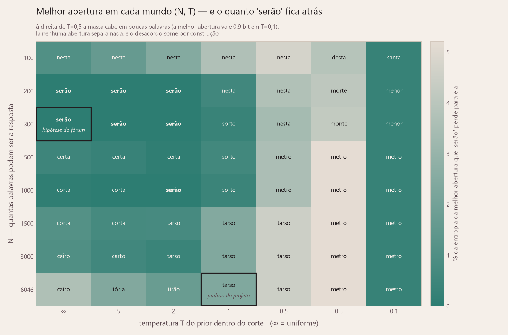
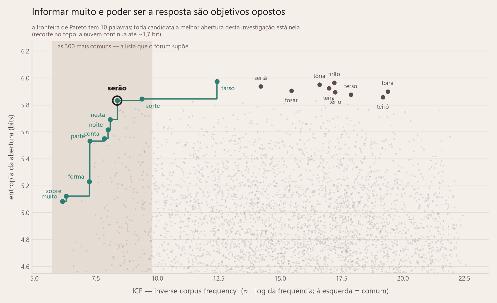

<p align="center">
  
</p>

<h1 align="center">Destermo</h1>
<p align="center"><i>O palpite ótimo do Termo.</i></p>

Solver de [Termo](https://term.ooo) escrito em Python. Você joga, diz a ele as
cores que o jogo devolveu, e ele responde qual palavra jogar em seguida.

O solver **nunca conhece a palavra secreta**. A cada rodada ele guarda as
palavras do léxico ainda compatíveis com todo o feedback recebido e escolhe a
jogada que minimiza quantas tentativas ainda faltam. No benchmark isso vence
todas as partidas, com média de 2,85 tentativas no nível 3 e 3,58 no nível 2.

O repositório tem duas frentes. Uma **ferramenta**, que sugere a próxima palavra
enquanto se joga: um app web ([`app.py`](app.py)) e uma CLI
([`solver.py`](solver.py)). E uma **análise**, que mede em tentativas o quanto
cada ideia do algoritmo vale de fato ([`benchmark.py`](benchmark.py) e os
[resultados](#resultados)). A divisão sai da
[especificação v1.1](docs/ESPECIFICACAO_v1.1.md); a
[v1.0](docs/ESPECIFICACAO_v1.0.md) fica no histórico porque os resultados das
duas são comparados aqui embaixo.

---

## Como o solver pensa

Esta seção é a espinha do projeto: três níveis de algoritmo, cada um corrigindo
um erro do anterior. Tudo que vem depois — código, benchmark, resultados — é
consequência dela.

### O estado do jogo é um conjunto

O Termo dá 6 tentativas para achar uma palavra de 5 letras. Cada tentativa volta
com 5 cores: 🟩 letra certa no lugar certo, 🟨 letra existe fora do lugar,
⬛ letra não existe.

Toda a informação de uma partida cabe num conjunto:

> **C** = as palavras do léxico que produziriam *exatamente* o feedback visto até
> agora.

`C` começa com as 6.046 palavras do léxico e só encolhe. Manter `C` é a parte
fácil, e não é onde os solvers erram: basta reusar a mesma função de feedback do
jogo e ficar com quem bate ([`termo/feedback.py`](termo/feedback.py)).

A pergunta difícil é a outra: **qual palavra jogar agora?** Os três níveis são
três respostas para ela.

### Nível 1 — frequência de letras

*"Jogue a palavra com as letras mais comuns entre as candidatas."*

É a heurística intuitiva e é o que a maioria dos solvers de Termo por aí faz. No
benchmark ela resolve 92,9% das partidas em 4,17 tentativas: melhor que chutar ao
acaso, e pouco mais que isso.

O furo é que **letra comum não é informação**. Uma palavra pode ter cinco letras
frequentíssimas e ainda assim deixar 300 candidatas de pé, se todas elas
responderem com o mesmo padrão de cores. A heurística otimiza a palavra jogada;
o que importa é o que ela faz com o conjunto.

### Nível 2 — entropia

O que interessa é como a jogada **divide** `C`. Uma tentativa `g` particiona o
conjunto em até 243 grupos (3⁵ padrões de cores possíveis): cada candidata cai no
grupo do padrão que ela devolveria. Se um grupo concentra quase tudo, a jogada
quase não informa; se os grupos saem pequenos e parecidos entre si, ela informa
muito.

Isso é exatamente a entropia de Shannon da partição:

```
p(padrão) = massa das candidatas que responderiam esse padrão / massa total
H(g)      = -Σ p · log₂ p                                          [bits]
```

Joga-se o `g` de maior `H`. Duas sutilezas que valem tentativas:

- **O espaço de jogadas é o léxico inteiro**, não só `C`. Vale "queimar" uma
  tentativa numa palavra que não pode ser a resposta, se ela separar melhor.
- **`H` mede a partição inteira**, então `g` é avaliado contra todas as
  candidatas de uma vez. Fazer isso 6.046 vezes por jogada é o que exige a matriz
  de padrões pré-computada ([`termo/matriz.py`](termo/matriz.py)).

### O prior: nem toda candidata é igualmente provável

O Termo sorteia `festa`, não `leruê`. As duas estão no léxico; só uma vai cair de
verdade. O arquivo `icf` do [`fserb/pt-br`](https://github.com/fserb/pt-br) dá o
**Inverse Corpus Frequency** de cada palavra (score baixo = palavra comum), e ele
vira um peso:

```
prior(w) = softmax(-ICF(w) / T)
```

`T` é um dial contínuo entre os dois primeiros níveis:

| T | o que acontece |
|---|---|
| T → 0 | corte quase binário: só as palavras mais comuns têm peso |
| **T = 1** | **padrão do projeto** |
| T → ∞ | pesos iguais — recupera a entropia pura, sem prior |

O prior entra pesando as **candidatas** dentro de `H`; ele nunca restringe quais
jogadas testar. Medido no benchmark, vale **0,31 tentativa**.

### Nível 3 — o objetivo real

Aqui está o pulo do gato, e é a correção que o 3Blue1Brown publicou depois da
lição original: **bits são um proxy, não o objetivo.** O jogo não premia
informação, premia acabar cedo — e as duas coisas divergem. A jogada que mais
separa costuma ser uma palavra que *não pode ser a resposta*, ou seja, uma que
garantidamente não encerra a partida naquela rodada.

O nível 3 otimiza o número esperado de tentativas, diretamente:

```
V(S, r) = min_g [ 1 + Σ_{padrão ≠ GGGGG} P(padrão | S) · V(S_padrão, r-1) ]
V(S, 0) = 7        acabaram as rodadas sem acertar
```

Em voz alta: *jogar `g` custa 1 tentativa; nos casos em que não acerto, herdo o
sub-conjunto correspondente e sigo jogando bem a partir dali.*

O `r` — rodadas restantes — não é decoração. Sem ele o solver otimiza um jogo de
tentativas ilimitadas e cai na espiral clássica do Termo, `prima → urina → brida
→ crica → criva`: cinco candidatas prováveis que se distinguem por uma letra só.
Cada jogada dessas maximiza a chance de acertar *agora*, o valor esperado adora
isso, e a partida acaba na 7ª. Com o limite na recursão a busca enxerga a parede
e gasta uma jogada separando o grupo.

Tomada de frente, a recursão é intratável. Três coisas a domam — e a primeira é a
mais bonita:

- **beam** — só os `K` palpites de maior entropia entram na busca em cada nó. Ou
  seja: **o nível 2 vira o *move ordering* do nível 3.** O proxy não era inútil;
  o erro era tomá-lo como resposta final.
- **profundidade** — abaixo de `P` níveis a recursão cai na política gulosa do
  nível 2. Como uma política concreta é sempre um limite *superior* de `V`, o
  valor só melhora quando `P` cresce: a busca é *anytime*, e `P=0` com `beam=1`
  reproduz o próprio nível 2.
- **memoização + poda** — os mesmos estados reaparecem muito, e a soma parcial só
  cresce, então um palpite é abandonado no meio assim que passa do melhor custo já
  encontrado no nó.

### Os três lado a lado

| nível | escolhe por | 1.500 palavras | 300 palavras |
|---|---|---|---|
| 1 — freq. de letras | letras mais comuns em `C` | 4,171 | — |
| 2 — entropia | maior `H(g)`, com prior | 3,581 | 3,397 |
| **3 — tentativas esperadas** | menor `V(S, r)` | — | **2,853** |

As duas colunas são baterias diferentes e **não se comparam entre si**; compare só
dentro de uma coluna. O nível 3 roda numa bateria menor porque custa ~47× mais CPU
por partida — o head-to-head honesto é a coluna de 300, com as mesmas secretas
para os dois.

**O nível 3 é o padrão da CLI.** O nível 2 continua sendo o padrão do benchmark,
onde são 1.500 partidas por estratégia e o custo pesa.

---

## Instalação

Python 3.10+ com `numpy`. Para o app web, `streamlit`. Para os gráficos,
`matplotlib`. Para os testes, `pytest`.

```bash
pip install -r requirements.txt
```

Nada em `data/` é versionado, com uma exceção deliberada (as aberturas em cache):
as fontes são baixadas do [`fserb/pt-br`](https://github.com/fserb/pt-br) na
primeira execução e a matriz de padrões se reconstrói em ~4 s. Basta clonar e
rodar.

## Uso

### No navegador

```bash
streamlit run app.py
```

O tabuleiro é a entrada. A palavra sugerida já aparece em fantasma na linha
ativa, e cada casa é um botão que cicla pelas cores do jogo a cada clique:
ausente, fora de lugar, no lugar. Marque o que o Termo devolveu e aperte
**Registrar rodada**; a linha sobe para o tabuleiro e sai a sugestão seguinte.
Para jogar outra palavra que não a sugerida, digite-a no campo abaixo do
tabuleiro. Na barra lateral ficam o nível, a temperatura do prior e o espaço
ampliado, todos trocáveis no meio da partida.

O nível 3 só abre na hora se a abertura da configuração escolhida estiver em
cache. Fora das versionadas são ~9 min de busca na árvore, então o app avisa e
manda calculá-la pela CLI (veja [Opções](#opções)) em vez de pendurar a aba.

### Na linha de comando

```bash
python solver.py
```

```
Solver de Termo — nível 3: menor nº esperado de tentativas
Digite '?' a qualquer momento para ver os comandos.
léxico: 6046 palavras   T=1.0   beam=10 profundidade=1

Calculando a melhor abertura...
  melhor abertura: tosar   (5.91 bits, E=3.01 tentativas, é candidata)
  motivo: melhor abertura do nível 3 (em cache)
  alternativas: tarso*, sertã*, terso*, tória*, tirão*   (* = também é candidata)

[1] tentativa > tosar
[?] feedback de 'tosar' > BBBBY

  candidatas restantes: 145
  sugestão: breve   (3.51 bits, E=2.02 tentativas, é candidata)
  motivo: menor nº esperado de tentativas (E=2.017) entre os 11 melhores palpites
          por entropia (145 candidatas, 5 rodadas, profundidade 1)
  alternativas: crime*, greve*, livre*   (* = também é candidata)

[2] tentativa > breve
[?] feedback de 'breve' > BYYYG

  candidatas restantes: 3
  sugestão: verde   (0.12 bits, E=1.02 tentativas, é candidata)
  motivo: menor nº esperado de tentativas (E=1.017) entre os 11 melhores palpites
          por entropia (3 candidatas, 4 rodadas, profundidade 1)
```

6.046 → 145 → 3. Repare no `E` caindo junto: 3,01 → 2,02 → 1,02 tentativas ainda
esperadas. É o número que o nível 3 minimiza, mostrado a cada jogada.

Digite as tentativas **sem acento** — é o que o jogador faz no term.ooo, que
preenche os acentos sozinho. Entrada acentuada também é aceita e normalizada. As
sugestões saem na forma acentuada, que é a que aparece na tela do jogo.

O feedback aceita `G`/`Y`/`B` (maiúsculo ou minúsculo), `2`/`1`/`0` ou os emojis
🟩🟨⬛. Comandos: `voltar` desfaz a última rodada, `listar` mostra as candidatas,
`?` mostra a ajuda, `sair` encerra.

### Opções

O padrão é o nível 3, com a abertura já em cache no repositório e décimos de
segundo por jogada. Para o nível 2 puro — entropia, milissegundos por jogada:

```bash
python solver.py --nivel 2
```

Outras temperaturas do prior (`inf` desliga o prior e recupera a entropia pura):

```bash
python solver.py --t 2
```

```bash
python solver.py --t inf
```

Para deixar o solver sondar com palavras que o Termo aceita mas nunca sorteia
(conjugações verbais — 8.628 palavras jogáveis contra as mesmas 6.046 respostas
possíveis):

```bash
python solver.py --ampliado
```

Na primeira vez ele baixa o arquivo `conjugações` da fonte e monta uma matriz de
padrões própria (~10 s). Não espere ganho:
[a medição está abaixo](#ampliar-o-espaço-de-tentativa-não-paga) e deu zero no
nível 2 — no nível 3 dá negativo, então lá a opção é contraindicada.

**Atenção ao combinar `--t` com o nível 3.** Só a configuração padrão
(`T=1, beam=10, profundidade=1`) vem com a abertura pronta em
`data/aberturas_nivel3.json`; qualquer outra é uma busca a partir das 6.046
candidatas e leva ~9 min, uma vez, antes da primeira sugestão. A CLI avisa e
sugere `--nivel 2` para começar na hora. O tamanho da busca é ajustável por
`--beam` (palpites testados por nó) e `--profundidade` (níveis de busca antes de
cair na política gulosa) — cada combinação tem a sua própria abertura em cache.

### Benchmark e gráficos

```bash
python benchmark.py --bateria realista
```

```bash
python benchmark.py --bateria completo
```

```bash
python benchmark.py --varredura-t
```

```bash
python benchmark.py --nivel3
```

```bash
python benchmark.py --serao
```

```bash
python benchmark.py --catalogo
```

```bash
python benchmark.py --ampliado
```

```bash
python -m termo.robustez
```

```bash
python analise.py
```

### Testes

```bash
python -m pytest tests -q
```

## Estrutura

O motor é independente da interface. A CLI e o app web são duas camadas finas
sobre o mesmo `termo/`, e nenhuma linha de lógica de solver mora fora dele: pôr o
solver numa página não exigiu mexer em nada lá dentro.

| Arquivo | Papel |
|---|---|
| `termo/feedback.py` | Normalização de acentos, regra das duas passadas, codificação base-3, detector de padrão impossível |
| `termo/lexico.py` | Download, filtro de 5 caracteres, agrupamento por forma normalizada, dedupe por ICF, prior |
| `termo/matriz.py` | Matriz 6.046 × 6.046 de padrões pré-computados (numpy vetorizado); 8.628 × 6.046 com `--ampliado` |
| `termo/entropia.py` | Cálculo de entropia, regra de endgame, cache da abertura (nível 2) |
| `termo/nivel3.py` | Busca na árvore de decisão pelo menor nº esperado de tentativas (nível 3) |
| `termo/robustez.py` | Número efetivo de palavras (M = 2^H) e minimax de arrependimento sobre a distribuição desconhecida |
| `termo/estrategias.py` | As estratégias do benchmark |
| `solver.py` | CLI interativa (só I/O) |
| `app.py` | App web em Streamlit (só I/O): tabuleiro clicável e cores da marca |
| `benchmark.py` | Simulação de partidas e métricas |
| `analise.py` | Gráficos e tabela de resultados |

Cada palavra tem duas formas (§2.4): a **normalizada** (`terco`), usada em todo
cálculo, e a de **exibição** (`terço`), puramente cosmética. O léxico final fica
em `termo_lexico_5letras.txt` na forma acentuada; `data/` guarda as fontes
baixadas e os artefatos gerados.

Dois espaços de índice convivem no motor: as **candidatas** (o que pode ser a
secreta) e as **sondas** (o que pode ser digitado). No modo padrão são o mesmo
conjunto; com `--ampliado` as sondas viram um superconjunto que tem as candidatas
no prefixo — é isso que deixa todo índice de candidata continuar valendo, e o
acréscimo fica em `termo_sondas_extra.txt`.

---

## Resultados

Os números abaixo seguem a mesma cadeia da seção anterior: primeiro o léxico sobre
o qual tudo repousa, depois a abertura, depois **quanto cada nível vale em
tentativas**. Todos saem de `benchmark.py`, que grava os JSONs em
[`resultados/`](resultados/); de lá o `analise.py` tira os gráficos e a
[tabela em texto](resultados/tabela.md). Os JSONs não são versionados — cada
comando abaixo regenera o seu —, mas os PNGs e a tabela sim, para que esta seção
se leia inteira sem clonar nada.

As quatro baterias foram medidas na mesma máquina, então as colunas `s/jogo` se
comparam entre si. Elas são a única coisa aqui que depende do hardware: médias e
distribuições são determinísticas e reproduzem dígito por dígito.

### O léxico

Todos os números da §2.2 e §2.3 foram reproduzidos exatamente a partir da fonte:

| Passo | Resultado |
|---|---|
| 5 caracteres em `lexico` | 6.301 |
| Grupos por forma normalizada | 6.046 |
| Grupos com colisão | 242 (497 palavras, 7,9%) |
| **Léxico final** | **6.046** |
| Cobertura do ICF | 100% |
| Palavras com "ç" | 172 |

A dedupe escolhe variantes plausíveis: `terço` (não `terco`, `terçó` ou `terçô`),
`agora`, `pique`, `manto`. `festa` — a palavra de 5 jan 2022 (§2.7) — está no
léxico. O sinal de validação da §2.3 se confirma: as 6.046 ficam a 20 palavras das
6.026 que o Gabriel Yshay obteve por um caminho independente.

### A abertura muda com o objetivo

A primeira jogada não depende de feedback nenhum, então é fixa e vai para o disco.
Cada nível escolhe uma:

| | abertura | entropia | E[tentativas] | posição no ranking de entropia |
|---|---|---|---|---|
| Nível 2 | `tarso` | **5,97 bits** | — | 1ª |
| Nível 3 | `tosar` | 5,91 bits | **3,01** | **6ª** |

As duas usam exatamente as mesmas cinco letras. `tosar` é a sexta do léxico em
entropia — o nível 2 a lista por *último* entre as cinco alternativas que
oferece — e mesmo assim é a que minimiza o número esperado de tentativas. É a
correção do 3B1B em uma linha: **maximizar bits não é minimizar tentativas.**

O ranking de entropia com T=1, para referência: `tarso` (5,97), `tirão` (5,97),
`tória` (5,95), `sertã` (5,94), `teira` (5,92), `tosar` (5,91).

### E o `serão` dos fóruns?

Pergunte a abertura ótima do Termo num fórum e a resposta é `serão`. Aqui ela não
é ótima em nível nenhum — fica em **12º** no ranking de entropia. Vale entender
por quê, porque o consenso não é bobo: ele otimiza um problema vizinho, e cada
uma das três diferenças sozinha já bastaria para tirar `serão` do topo.

**Diferença 1 — o léxico de palpites.** Quem está à frente dele:

| # | palavra | H | posição em frequência |
|---|---|---|---|
| 1 | `tarso` | 5,975 | 1126/6046 |
| 2 | `tirão` | 5,966 | 3632 |
| 3–10 | `tória`, `sertã`, `teira`, `tosar`, `toira`, `tério`, `terso`, `teiró` | 5,95–5,86 | 2008–4936 |
| 11 | `sorte` | 5,844 | 219 |
| **12** | **`serão`** | **5,833** | **83** |

As dez primeiras são palavras que ninguém digitaria por vontade própria. `serão`
é a 83ª palavra mais comum do léxico: ele é o melhor palpite **entre os que um
humano considera**, que é a restrição que um fórum aplica sem declarar.

**Diferença 2 — a lista de respostas.** Restringindo as candidatas às N mais
comuns, com peso uniforme dentro do corte, `serão` sobe — e no cenário completo
do fórum, em que a mesma lista curta também limita os palpites, ele chega ao topo:

| N | palpites = léxico | palpites = as próprias N |
|---|---|---|
| 200 | 7º | **1º** |
| 300 | **2º** (atrás de `tirão`) | **1º** |
| 500 | 8º | 2º (`certa`) |
| 1000 | 7º | 2º (`corta`) |
| 1500 | 9º | 3º (`corta`) |

O ponto doce é uma lista de ~200–400 palavras comuns, que é mais ou menos o que
se intui como "o que o Termo sorteia". **A recomendação é reproduzível**, então.

Note que o dial `T` da §4.2 **não** chega lá: baixar a temperatura concentra a
massa em meia dúzia de palavras em vez de truncar e uniformizar, e a abertura
foge para outro lado.

| T | ∞ | 2 | 1 | 0,5 | 0,3 | 0,1 |
|---|---|---|---|---|---|---|
| melhor abertura | `cairo` | `tirão` | `tarso` | `tarso` | `metro` | `mesto` |
| posição de `serão` | 31ª | 6ª | 12ª | 109ª | 339ª | 946ª |

Corte duro com uniforme dentro é um regime que o prior contínuo não cobre em
ponto nenhum — e o mais próximo dele é T≈2, não T→0.

**Diferença 3 — o objetivo.** Esta é a que sobrevive a tudo. No mundo de 300
palavras, onde `serão` é o primeiro em bits, ele continua não sendo a melhor
jogada. As rivais saem da busca do nível 3 nesse mesmo mundo, e a média é das 300
partidas com a mesma política depois da abertura:

| abertura | média |
|---|---|
| `sorte` | **2,770** |
| `certa` | 2,773 |
| `terça` | 2,780 |
| `serão` | 2,810 |

É a correção do 3B1B aplicada ao consenso popular: **`serão` maximiza os bits e
mesmo assim custa 0,04 tentativa a mais.** No jogo de verdade — 6.046 possíveis,
bateria realista — a conta fica em 3,669 contra os 3,581 de `tarso`.

(As médias jogadas batem dígito a dígito com o `E` que a busca previu para cada
abertura: com profundidade 1 o valor do nível 3 é exatamente `1 + Σ p·V_guloso`,
e `V_guloso` é a política do nível 2 — que é a que joga da segunda rodada em
diante. Os dois caminhos medindo a mesma coisa é um teste de sanidade de graça.)

De onde vem a recomendação, então? Provavelmente do nível 1. Pelo score de
frequência de letras sobre as palavras comuns, `serão` é **4º de 6.046**, e as
três à frente (`oreia`, `orate`, `reato`) são obscuras — ele é a primeira palavra
da lista que alguém reconhece. S, E, R, A, O são simplesmente as cinco letras
mais frequentes, e é isso que a intuição dos fóruns está medindo. O léxico
completo desfaz até isso: contra as 6.046, `serão` cai para 38º na mesma
heurística.

#### Só que ninguém sabe em que mundo está

Todo o veredito acima — o nosso e o do fórum — supõe que a lista de respostas é
conhecida. Ela não é: é uma hipótese nossa, e as três seções anteriores mostraram
que a resposta muda com ela. Sob incerteza a pergunta certa não é "qual é a
melhor?", e sim **"qual é a menos pior no seu pior mundo?"**.

Aqui os mundos são *abertos*: o corte vale para as respostas, mas o léxico
inteiro continua digitável — `tarso` não está entre as 300 mais comuns e mesmo
assim é uma jogada legal. Média penalizada em cada mundo, e entre parênteses o
que a abertura perde para a melhor daquele mundo:

| abertura | | N=300 | N=1500 | N=6046 | **pior caso** |
|---|---|---|---|---|---|
| `sorte` | | 2,760 (+0,000) | 3,263 (+0,000) | 3,849 (+0,001) | **0,001** |
| `tarso` | nível 2 | 2,770 (+0,010) | 3,266 (+0,003) | 3,848 (+0,000) | 0,010 |
| `cairo` | | 2,783 (+0,023) | 3,282 (+0,019) | 3,862 (+0,013) | 0,023 |
| `tirão` | | 2,760 (+0,000) | 3,292 (+0,029) | 3,860 (+0,012) | 0,029 |
| `tosar` | nível 3 | 2,780 (+0,020) | 3,287 (+0,024) | 3,890 (+0,042) | 0,042 |
| `serão` | fóruns | 2,787 (+0,027) | 3,331 (+0,068) | 3,906 (+0,057) | 0,068 |

Duas leituras se sustentam:

- **`serão` é o pior dos seis.** Não é robusto: perde em todos os mundos, e mais
  onde o mundo é grande. A crítica desta seção sobrevive à mudança de régua.
- **O pior arrependimento da tabela inteira é 0,07 tentativa.** A discussão toda
  — fórum contra solver, nível 2 contra nível 3 — vale menos de um décimo de
  tentativa se a abertura for escolhida com um mínimo de cuidado.

**O que esta tabela NÃO autoriza é eleger uma vencedora**, e a primeira versão
desta seção o fazia. A referência de cada coluna aqui é a melhor das seis
candidatas, não a melhor abertura daquele mundo — com uma régua tirada do próprio
conjunto comparado, quem estiver no topo dele termina com arrependimento zero por
construção, e o número diz mais sobre a companhia do que sobre a palavra. O
veredito de robustez está em [E se a própria distribuição for
desconhecida?](#e-se-a-própria-distribuição-for-desconhecida), que usa três
mundos a mais, uma referência independente e mede a esperança exata em vez da
média de uma bateria. **Lá quem se sai bem é `tarso`, não `sorte`.**

Continua valendo desta tabela o que ela mede de fato: como cada abertura joga em
três mundos concretos, e que `tosar` — otimizado sob o prior de T=1 — é quem mais
se degrada quando o mundo vira uniforme.

#### O mapa: os dois botões de uma vez

As duas varreduras de uma dimensão só — cortar a lista, baixar o prior — parecem
dar respostas contraditórias. São os dois eixos de um mapa, e vistas assim param
de brigar. Cada célula é um mundo, e o nome escrito nela é a melhor abertura ali:



O território de `serão` é um bloco pequeno e bem delimitado: **N entre 200 e 300,
com prior fraco (T≥2)**. Fora dali ele nunca é o melhor. As duas posições
conhecidas estão marcadas, e agora se lê a distância entre elas — o padrão do
projeto e a hipótese do fórum não são cantos opostos, são vizinhos separados por
uma faixa em que `sorte` e `certa` mandam.

Duas coisas que só o mapa mostra:

- **`sorte` domina a coluna de T=1 na faixa do meio** (N de 300 a 1000). Vale
  notar que essa faixa é estreita: no minimax sobre a família inteira de
  distribuições ela nem aparece no pódio, que é de `tarso` e `sertã`.
- **A coluna de T=0,1 é escura de cima a baixo, e isso não é vitória de ninguém.**
  Com o prior tão concentrado, a melhor abertura do mundo vale 0,9 bit: não há o
  que separar, e todas as jogadas empatam em quase-nada. O gráfico usa a distância
  *relativa* justamente por isso — em bits absolutos aquele canto pareceria verde.

#### A troca por trás de tudo

Uma abertura quer duas coisas incompatíveis: separar muito o conjunto e poder ser
a resposta. A fronteira de Pareto — as palavras em que ganhar numa exige perder na
outra — tem **dez palavras**, e todas as candidatas que apareceram nesta
investigação estão nela:



`muito` → `sobre` → `forma` → `parte` → `conta` → `noite` → `nesta` → **`serão`**
→ **`sorte`** → **`tarso`**.

Ninguém errou a conta: cada um escolheu um ponto diferente da mesma curva. O fórum
parou em `serão` porque é o mais informativo *dentro* da faixa que ele considera
plausível; o solver foi até `tarso`, a ponta da curva, porque não impõe faixa
nenhuma. E `sorte` é o ponto entre os dois — 5,84 bits contra os 5,98 de `tarso`,
com um terço do ICF — que é exatamente por que ele ganha quando o mundo é
incerto.

O gráfico também fecha a primeira diferença sem precisar de tabela: as dez
melhores em entropia formam uma faixa inteira **à direita** da região das comuns.
Ser informativo e ser plausível quase não se sobrepõem no português.

#### O catálogo: qual palavra para qual cenário

Juntando tudo, "qual é a abertura ótima do Termo" só tem resposta depois de três
premissas declaradas: **o objetivo** (bits ou tentativas), **quais palavras podem
cair** e **quais você aceita digitar**. Dezesseis palavras diferentes são ótimas
em algum cenário.

**Mundo completo** — qualquer uma das 6.046 pode cair:

| objetivo | prior | abertura |
|---|---|---|
| nível 1 — letras mais frequentes | — | `oreia` |
| nível 2 — bits | T→∞ | `cairo` (6,203 bits) |
| nível 2 — bits | T=2 | `tirão` |
| nível 2 — bits | **T=1 (padrão)** | **`tarso`** (5,975) |
| nível 2 — bits | T=0,3 | `metro` |
| nível 2 — bits | T=0,1 | `mesto` |
| nível 3 — tentativas | **T=1 (padrão da CLI)** | **`tosar`** (E=3,009) |
| nível 3 — tentativas | T→∞ | `tória` (E=3,825) |

**Mundo aberto** — só as N mais comuns caem, mas o léxico inteiro é digitável:

| N | ótimo em bits | ótimo em tentativas |
|---|---|---|
| 300 | `tirão` (5,913) | `sertã` (E=2,760) |
| 1.500 | `tirão` (6,237) | `torça` (E=3,233) |
| 6.046 | `cairo` (6,203) | `tória` (E=3,825) |

**Mundo fechado** — respostas e palpites saem da mesma lista curta. É o cenário
dos fóruns, e a coluna da direita é a que faltava:

| N | ótimo em bits | ótimo em tentativas |
|---|---|---|
| 100 | `nesta` (5,439) | `nesta` (E=2,400) |
| **200** | **`serão`** (5,725) | `norte` (E=2,670) |
| **300** | **`serão`** (5,864) | `sorte` (E=2,770) |
| 500 | `certa` (6,001) | `terça` (E=2,904) |
| 1.000 | `corta` (6,069) | `certo` (E=3,135) |
| 1.500 | `corta` (6,185) | `certa` (E=3,261) |
| 3.000 | `cairo` (6,160) | `corta` (E=3,529) |
| 6.046 | `cairo` (6,203) | `tória` (E=3,825) |

Duas coisas saltam desta tabela. A primeira é que **`serão` não é o ótimo de
tentativas em N nenhum** — nem nos dois cortes onde ele é o campeão em bits. A
crítica da terceira diferença não era um detalhe do mundo de 300: vale na faixa
inteira. A segunda é que a coluna da direita é povoada por palavras banais —
`norte`, `sorte`, `terça`, `certo`, `certa`, `corta` — enquanto a da esquerda
puxa para `cairo` e `tória`. Minimizar tentativas prefere palavras que podem ser
a resposta; maximizar bits, não.

(A última linha das duas últimas tabelas é a mesma: sem corte, mundo aberto e
fechado são o mesmo mundo. Os dois caminhos dão `tória` com E=3,8252 — é uma
checagem de consistência de graça.)

#### E se a própria distribuição for desconhecida?

Todas as tabelas acima fixam um mundo antes de perguntar qual é a melhor
abertura. Esta inverte: trata a distribuição das secretas como incógnita e mede
o **número efetivo de palavras** que cada prior admite,

```
M(prior) = 2^H(prior)      [uniforme sobre K palavras dá exatamente K]
```

Nessa régua o prior padrão do projeto (T=1) vale **M=447** — ele já é uma aposta
forte, mais perto de "lista curada" que de "não sei nada":

| T | 0,25 | 0,5 | **1** | 2 | 4 | ∞ |
|---|---|---|---|---|---|---|
| M | 7,7 | 60,6 | **447** | 1.872 | 4.149 | 6.046 |

**M é suficiente, quase sempre.** Antes de reduzir tudo a um eixo, o módulo
testa se formas diferentes com a mesma concentração escolhem a mesma abertura.
Para M=1200 por três caminhos — corte em 6.046/3.000/1.500 com o T ajustado —, as
três dão `tirão`, com gap de 0,0000 bit. O mesmo vale em M=300, 600 e 2.400. **Em
M=4.800 o colapso falha** (`tirão` contra `tória`): perto do uniforme a forma do
corte volta a importar, e a grade abaixo, que usa só T, não distingue esse caso.

A matriz de arrependimento (regret = tentativas a mais que a melhor abertura
daquele mundo, tudo em nível 2):

| abertura | M=300 | M=447 | M=600 | M=1200 | M=2400 | M=4800 | M=6046 | **pior caso** |
|---|---|---|---|---|---|---|---|---|
| | *curada* | *padrão* | | *Wordle* | | | *nada sei* | |
| **`sertã`** | 0,0283 | 0,0109 | 0,0000 | 0,0000 | 0,0084 | 0,0198 | 0,0281 | **0,0283** |
| `tarso` | 0,0000 | 0,0000 | 0,0101 | 0,0027 | 0,0112 | 0,0290 | 0,0255 | 0,0290 |
| `tória` | 0,0364 | 0,0425 | 0,0323 | 0,0382 | 0,0528 | 0,0437 | 0,0122 | 0,0528 |
| `corta` | 0,0617 | 0,0507 | 0,0467 | 0,0192 | 0,0000 | 0,0098 | 0,0000 | 0,0617 |
| `tirão` | 0,0525 | 0,0553 | 0,0643 | 0,0582 | 0,0608 | 0,0481 | 0,0364 | 0,0643 |
| `tosar` | 0,0603 | 0,0412 | 0,0384 | 0,0391 | 0,0385 | 0,0490 | 0,0686 | 0,0686 |
| `cairo` | 0,0702 | 0,0602 | 0,0584 | 0,0546 | 0,0567 | 0,0493 | 0,0392 | 0,0702 |
| `carto` | 0,0985 | 0,0833 | 0,0671 | 0,0137 | 0,0042 | 0,0000 | 0,0012 | 0,0985 |

No papel a vencedora é `sertã`, com 0,0283 contra os 0,0290 de `tarso`. **Mas
essa margem de 0,0007 não sobrevive à própria grade.** Tirando uma coluna de cada
vez — e a composição da grade é escolha nossa, não dado —, o pódio inverte:

| grade | vencedora | 2ª |
|---|---|---|
| completa | `sertã` (0,0283) | `tarso` (0,0290) |
| sem M=4800 | **`tarso` (0,0255)** | `sertã` (0,0283) |
| sem qualquer outra coluna | `sertã` (0,0283) | `tarso` (0,0290) |

Uma coluna decide. A leitura honesta é que **`sertã` e `tarso` estão empatados, e
a abertura do nível 2 é robusta** — o que é o resultado mais tranquilizador que
esta análise poderia dar: o solver já joga uma abertura que não depende do prior
estar certo. `sertã` é a curiosidade, não a recomendação.

Quem paga a conta é `tosar`, a abertura da CLI: 0,069, mais que o dobro, e o pior
caso dela é justamente o mundo uniforme. É a ressalva do nível 3 vista de outro
ângulo — ele otimiza *sob* o prior, então erra mais quando o prior erra.

**Quanto custa usar `tosar` com a distribuição errada?** No máximo 0,069
tentativa. A discussão inteira desta seção cabe em sete centésimos de tentativa,
o que é a informação mais útil da tabela: qualquer uma dessas oito aberturas é
uma escolha defensável, e trocar de abertura não é onde estão os ganhos.

Levada ao nível 3, `sertã` não constrói caso para virar padrão:

| | `sertã` | `tosar` (padrão) |
|---|---|---|
| E na raiz, T=1 | 3,0249 | **3,0094** |
| bateria realista 1.500 | **3,4580** | 3,4893 |
| vitória | 99,93% | **100,0%** |

Ela perde na métrica que a CLI otimiza, ganha 0,031 tentativa jogando, e troca
isso por uma derrota em 1.500 partidas. Somando com o empate técnico acima: **não
há motivo para mexer na abertura de nenhum dos dois níveis.** O que a análise
entrega não é uma palavra nova, é a medida de quanto a escolha atual depende de
uma premissa — e a resposta é "pouco, no nível 2; o dobro disso, no nível 3".

**Duas ressalvas que a tabela não carrega sozinha.** A primeira: minimax de
arrependimento é refém do conjunto de mundos admitidos — um M implausível na
grade sequestra o máximo sozinho. **O piso M=300 é uma escolha, não um dado.**
`piso_empirico` em [`termo/robustez.py`](termo/robustez.py) está pronto para
trocá-la por medição: dado um registro das secretas já sorteadas em
`data/secretas_sorteadas.txt`, a mais rara delas fixa o piso de M por baixo. O
arquivo não existe no repositório.

A segunda: a referência de cada coluna é a melhor abertura **do beam de
entropia**, não do léxico inteiro — varrer as 6.046 por coluna custaria ~8 h. É
o mesmo beam do nível 3, com a mesma justificativa e a mesma consequência: os
arrependimentos são limites inferiores.

Isto sai de `python -m termo.robustez` (~8 min, com cache em `data/robustez.json`
invalidado por assinatura do código) e a tabela vai para
[tabela.md](resultados/tabela.md) via `analise.py`.

#### Para escolher uma na prática

| se você… | jogue | por quê |
|---|---|---|
| não quer apostar em premissa nenhuma | **`tarso`** | menor arrependimento de pior caso sobre sete distribuições, de "lista curada" a uniforme (empatada com `sertã`) — e é a abertura do nível 2, então a CLI já a oferece com `--nivel 2` |
| confia no prior do projeto | **`tosar`** | é o padrão da CLI: menor E[tentativas] com T=1 sobre o léxico inteiro. Custa até 0,069 tentativa se o prior estiver errado |
| acha que só palavras bem comuns caem, e mede em **bits** | **`serão`** | é o ótimo do mundo fechado de 200–300 — aqui os fóruns estão certos |
| acha que só palavras bem comuns caem, e mede em **tentativas** | **`sorte`** (N≈300) ou **`certa`** (N≈500–1500) | ganhar cedo vale mais que informar muito |

O catálogo sai de `python benchmark.py --catalogo`, que grava
`resultados/catalogo.json`. Ele roda separado porque a última linha do mundo
fechado é a busca completa do nível 3 sobre as 6.046 — sozinha, ~5 min dos ~14 do
comando.

O resto da seção sai de `python benchmark.py --serao` seguido de
`python analise.py`: o primeiro grava `resultados/serao.json`, o segundo tira
dele os dois gráficos acima.

### Nível 1 → nível 2: a entropia compensa?

Esta é a pergunta central da §5.1. Bateria realista — as 1.500 palavras de menor
ICF, que é o que o jogo de fato sorteia. `média` conta só as partidas vencidas;
`penal.` conta derrota como 7.

| estratégia | média | penal. | vitória | 1 | 2 | 3 | 4 | 5 | 6 | s/jogo |
|---|---|---|---|---|---|---|---|---|---|---|
| aleatória | 4.269 | 4.505 | 91.3% | 0 | 54 | 299 | 438 | 383 | 196 | 0.0002 |
| freq. de letras | 4.171 | 4.371 | 92.9% | 0 | 44 | 333 | 523 | 329 | 165 | 0.0011 |
| mais provável | 3.707 | 3.740 | 99.0% | 1 | 108 | 555 | 538 | 227 | 56 | 0.0001 |
| **entropia (T=1)** | **3.581** | **3.581** | **100.0%** | 1 | 24 | 664 | 725 | 86 | 0 | 0.0039 |


**Os três palpites da §5.6 se confirmaram**, incluindo o mais específico:

- Entropia ficou em 3,58 na bateria realista — dentro da faixa 3,5–4 prevista.
- "Mais provável" chegou perto na média: 3,707 contra 3,581.
- **A diferença real aparece na taxa de vitória e no pior caso.** Entropia
  resolveu 100% das 1.500 palavras e **nenhuma** partida chegou à 6ª tentativa.
  "Mais provável" perdeu 15 partidas e chegou à 6ª em 56.

Stress test — léxico completo (6.046 palavras, incluindo obscuridades que o Termo
nunca sortearia):

| estratégia | média | penal. | vitória | 1 | 2 | 3 | 4 | 5 | 6 | s/jogo |
|---|---|---|---|---|---|---|---|---|---|---|
| aleatória | 4.328 | 4.564 | 91.2% | 1 | 154 | 1078 | 1900 | 1561 | 818 | 0.0002 |
| freq. de letras | 4.144 | 4.363 | 92.3% | 1 | 162 | 1400 | 2104 | 1301 | 615 | 0.0013 |
| mais provável | 4.268 | 4.459 | 93.0% | 1 | 145 | 1201 | 2027 | 1496 | 752 | 0.0001 |
| **entropia (T=1)** | **3.946** | **3.957** | **99.7%** | 1 | 56 | 1560 | 3150 | 1164 | 94 | 0.0014 |

O stress test mostra por que a régua importa: "mais provável" depende do prior
estar certo. Quando as secretas passam a incluir o léxico inteiro, ela cai de
3,71 para 4,27 e fica atrás da heurística de frequência de letras na média. A
entropia degrada de 3,58 para 3,95 e mantém 99,7%.

### Quanto vale o prior de frequência

A pergunta da §5.5. Como T→∞ recupera a entropia pura, esta curva compara o nível
1 e o nível 2 do algoritmo de forma contínua:

| T | 0.5 | 1 | 2 | 5 | 10 | ∞ |
|---|---|---|---|---|---|---|
| média (penal.) | 3.599 | **3.581** | 3.627 | 3.631 | 3.648 | 3.887 |
| vitória | 100.0% | 100.0% | 100.0% | 100.0% | 100.0% | 99.8% |


**O prior vale cerca de 0,31 tentativa** — de 3,89 (entropia pura) para 3,58
(T=1). É a resposta empírica para a camada que faltava no artigo brasileiro
citado na especificação.

O mínimo cai exatamente em **T = 1**, o valor padrão da v1. A curva é rasa entre
0,5 e 10 (amplitude de 0,07 tentativa, dentro do ruído de 1.500 partidas) e só
piora de verdade em T→∞. Ou seja: **ter um prior importa; calibrá-lo com precisão,
nem tanto.**

### Ampliar o espaço de tentativa não paga

O Termo aceita como tentativa palavras que nunca sorteia como resposta — as
conjugações verbais que a curadoria removeu. Nada obriga um palpite a poder ser a
resposta: ele só precisa separar bem. Somando as formas de 5 letras do arquivo
`conjugações` que ainda não estavam no léxico, o solver passa a ter **8.628
palavras jogáveis contra as mesmas 6.046 respostas possíveis** (`--ampliado`).

Sob o mesmo critério, mais opções não podem baixar a entropia máxima de jogada
nenhuma. E não baixam: num varredura de 60 estados de meio de jogo, a melhor
sonda é uma conjugação em 24 deles. Só que o ganho é de **0,034 bit em média**, e
a abertura nem muda — `tarso` continua ótima entre as 8.628.

Bits não são tentativas (§4.1), então o que decide é jogar:

| Espaço de tentativa | Bateria | Média | Penalizada | Derrotas | ms/jogo |
|---|---|---|---|---|---|
| 6.046 | realista (1.500) | 3,5807 | 3,5807 | 0 | 3,33 |
| 8.628 | realista (1.500) | 3,5807 | 3,5807 | 0 | 5,13 |
| 6.046 | completo (6.046) | 3,9464 | 3,9570 | 21 | 0,96 |
| 8.628 | completo (6.046) | 3,9400 | 3,9486 | 17 | 1,23 |

Na bateria realista a diferença é **exatamente zero** — não "dentro do ruído":
zero, nas duas casas que o benchmark reporta. A distribuição chega a se mexer (6
partidas migram de 4 para 3 tentativas, 6 outras vão de 4 para 5), e o saldo
cancela.

Na bateria completa, que é enumeração exaustiva e não amostra, ampliar ganha
**0,0084 tentativa** e converte 4 derrotas em vitórias — 21 para 17. O ganho é
real, e é todo em palavras como `gueja`, `riçar` e `bimar`, que o Termo não
sorteia. Custa 28% de CPU por jogada e uma segunda matriz de 52 MB.

#### No nível 3 ampliar chega a atrapalhar

Restava a suspeita de que o problema fosse o proxy: se ampliar rende bits que não
viram tentativas, talvez a busca pelo objetivo real (§4.1) soubesse usá-los. A
resposta é não — e é pior que empate:

| Espaço de tentativa | Média | Penalizada | s/jogo |
|---|---|---|---|
| 6.046 | 2,853 | 2,853 | 0,30 |
| 8.628 | 2,863 | 2,863 | 2,41 |

**Ampliar piora o nível 3 em 0,010 tentativa e custa 8× a CPU** (300 partidas,
beam=10, profundidade=1). O motivo não é estatístico, é estrutural: o beam é um
orçamento fixo de 10 palpites por nó, tirado da ordem de entropia. Medindo a
composição dele em 40 estados de meio de jogo, **27% dos slots vão para
conjugações** — 2,7 dos 10 em média, e em 9 dos 40 nós metade ou mais do beam é
sonda. Cada slot desses é uma jogada que a busca avalia sabendo que ela não pode
encerrar a partida, no lugar de uma candidata que poderia.

No nível 2 isso é inofensivo, porque lá a entropia não é só a ordenação: é o
critério. No nível 3 a ordem de entropia é apenas o *move ordering*, e o beam é
toda a visão que a busca tem do espaço de jogadas — enchê-lo de palavras que
nunca ganham a rodada estreita a busca em vez de alargá-la. Ampliar o beam
recuperaria a perda, ao custo que a ampliação queria evitar.

A conclusão é que a separação formal entre as duas listas — que a especificação
pôs fora de escopo (§12) — **estava certa em ficar fora**, e agora com dois
motivos medidos. No nível 2, porque o léxico de 6.046 já é grande o bastante para
conter, em quase todo estado, uma palavra tão informativa quanto a melhor
conjugação. No nível 3, porque sondas competem por um recurso escasso — as vagas
do beam — contra palavras que ainda podem ganhar o jogo.

O `--ampliado` fica no repositório porque a medição é o resultado; o padrão
continua sendo, e deve continuar sendo, as 6.046.

### Nível 2 → nível 3: o proxy contra o objetivo real

A especificação pôs o nível 3 fora de escopo por custo computacional (§4.1). Ele
está implementado em [`termo/nivel3.py`](termo/nivel3.py), **é o padrão da CLI**,
e o custo agora tem número.

#### No meio do jogo a diferença é grande

Depois de `tarso` com o `r` verde sobram 51 candidatas:

| | jogada | entropia | E[tentativas] |
|---|---|---|---|
| Nível 2 (entropia) | `miúde` | 2,01 bits | 2,03 |
| Nível 3 | `verde` | 1,83 bits | **1,43** |

O nível 3 abre mão de 0,18 bit para jogar uma **candidata**, que pode encerrar o
jogo ali. Com T=1 isso não é aposta: `verde` sozinha carrega 65% da massa de
probabilidade das 51. Subindo T o prior achata e a escolha converge para a do
nível 2 — em T=5 e T→∞ os dois jogam `miúde`. O dial da §4.2 governa os dois
níveis.

#### Head-to-head

As 300 palavras de menor ICF, mesmas secretas para os dois:

| estratégia | média | penal. | vitória | 1 | 2 | 3 | 4 | 5 | 6 | s/jogo |
|---|---|---|---|---|---|---|---|---|---|---|
| entropia (T=1) | 3.397 | 3.397 | 100.0% | 0 | 5 | 174 | 118 | 3 | 0 | 0.0103 |
| **nível 3 (K=10, P=1)** | **2.853** | **2.853** | **100.0%** | 0 | 77 | 191 | 31 | 1 | 0 | 0.4809 |


**O objetivo real vale 0,54 tentativa** — 3,397 para 2,853, com as duas
estratégias resolvendo 100%. O ganho não vem de evitar derrotas: vem de **acabar o
jogo na 2ª tentativa**, que a entropia consegue em 5 partidas e o nível 3 em 77.
Maximizar bits é exatamente a política que se recusa a tentar ganhar cedo.

Duas leituras que esta tabela **não** autoriza, ambas por ser outra bateria:

- Os 3,397 da entropia não batem com os 3,581 da tabela principal porque são 300
  palavras, não 1.500. Compare uma linha com a outra, não com a seção anterior.
- Os 10,3 ms da entropia não batem com os 3,9 ms de lá pelo mesmo motivo, por uma
  via menos óbvia: `escolher_com_cache` amortiza os estados repetidos entre
  partidas, e 300 jogos reaproveitam bem menos que 1.500. É a mesma conta, diluída
  por menos jogos.

#### Uma ressalva honesta

O nível 3 otimiza o valor esperado **sob o prior**, e o prior de T=1 é agressivo.
A consequência é que ele **sacrifica palavras raríssimas de propósito**: prefere
chutar a candidata provável a gastar uma jogada separando o grupo. Em `criva`
(ICF 19) ele entra na espiral `prima → urina → brida → crica` e perde uma partida
que o nível 2 ganha. Na bateria realista — o que o Termo de fato sorteia — isso
nunca acontece, e é justamente onde ele ganha 0,54 tentativa.

O `E = 3,01` da abertura é uma esperança ponderada pelo prior sobre o léxico
inteiro; a média do benchmark é uma contagem simples sobre as mais comuns. Os dois
números medem coisas diferentes e não se comparam.

### O custo, e por que ele caiu

Perfilando a busca do nível 3 num estado de 223 candidatas, **95% do tempo estava
em escolher o beam** — a varredura de entropia do léxico — e só ~2% na recursão
que minimiza tentativas. Pior: 87% das varreduras eram em conjuntos de **até 8
candidatas**, ou seja, percorrer 6.046 palavras para ranquear palpites contra
quatro.

O caminho geral de `entropias` monta uma tabela de 6.046 × 243 baldes; com poucas
candidatas isso é 11 MB alocados e zerados para preencher meia dúzia de colunas
por linha. Reescrevendo a mesma soma por agrupamento par a par
(`Motor._entropias_poucas`, `H = -Σ_c w_c·log₂(massa do grupo de c)`, custo n·m² em
vez de n·243), mais um cache do beam por conjunto:

| | antes | depois | |
|---|---|---|---|
| jogada com 223 candidatas | 6,96 s | 2,03 s | 3,4× |
| abertura do nível 3 | 953 s | 529 s | 1,8× |
| **nível 2, bateria realista** | 10,7 ms | 3,2 ms | **3,4×** |

Este par foi medido de uma vez só, na máquina onde a otimização foi feita; o que
vale aqui é a razão, não o valor absoluto. As tabelas de benchmark acima são de
outra máquina, ~20% mais lenta — daí os 3,9 ms onde aqui se lê 3,2 ms.

A conta é a mesma, não uma aproximação — e isso foi verificado, não suposto: a
abertura recalculada dá `tosar` com `3.0094161966572304`, dígito por dígito, e
reprocessar as duas baterias principais (7.546 partidas × 4 estratégias) muda
**apenas** os campos de tempo dos JSONs. O nível 2 levou o ganho junto, de graça.

Onde o custo ficou: o nível 3 é **47× mais CPU** que o nível 2 (0,48 s por jogo
contra 10,3 ms, na mesma bateria de 300), mais os ~9 min da abertura, que vem
versionada. Para uso interativo é tranquilo; para varrer 1.500 palavras em seis
temperaturas, não. A decisão da especificação continua defensável — o que mudou é
que agora ela é uma escolha informada, não uma suposição.

### Efeito da migração v1.0 → v1.1

O léxico corrigido melhorou tudo, como a §5.6 antecipava — menos candidatas para
separar:

| | v1.0 (8.996 palavras) | v1.1 (6.046 palavras) |
|---|---|---|
| Entropia, bateria realista | 3.685 | **3.581** |
| Entropia, stress test | 4.110 | **3.946** |
| Partidas na 6ª tentativa (realista) | 1 | **0** |
| Ganho do prior (T=1 vs T→∞) | 0.33 | 0.31 |
| Matriz | 81 MB, 20 s | **37 MB, 4 s** |
| Entropia da 1ª jogada | 1.4 s | **1.0 s** |
| T ótimo na varredura | 2 | **1** |

A abertura do nível 2 continua sendo `tarso` nas duas versões.

### Afinal, qual é a palavra ótima?

A pergunta que abre o projeto merece uma resposta fechada, e ela tem duas
partes.

**Se você quer uma palavra para digitar amanhã: `tarso`.** Ela é a única que
ganha dos dois lados da investigação — é a abertura do nível 2 sob o prior do
projeto (5,975 bits, a maior do léxico) **e** empata em primeiro no minimax de
arrependimento sobre sete distribuições, de "lista bem curada" a uniforme. Todas
as outras candidatas vencem num regime e perdem no outro: `tosar` é melhor se o
prior de T=1 estiver certo e o dobro de pior se não estiver; `serão` só é ótima
se a lista de respostas tiver ~300 palavras, e é a menos robusta das oito;
`sertã` supera `tarso` por 0,0007 tentativa, que uma coluna da grade decide.

Quem confia no prior do projeto joga `tosar`, que é o que a CLI sugere e o que
minimiza E[tentativas] sob a premissa declarada. `tarso` é a escolha de quem
prefere não apostar nela. A tabela de [Para escolher uma na
prática](#para-escolher-uma-na-prática) abre os outros casos.

**A segunda parte da resposta é mais útil que a primeira: a abertura vale
pouco.** O pior arrependimento entre as oito candidatas testadas é 0,069
tentativa. Ao lado das outras decisões deste README:

| decisão | vale |
|---|---|
| nível 1 → nível 2 — letras para entropia | **0,59 tentativa** |
| nível 2 → nível 3 — bits para tentativas | **0,54 tentativa** |
| o prior de frequência (T=1 contra T→∞) | **0,31 tentativa** |
| escolher bem a abertura | **≤ 0,07 tentativa** |

Cada linha é uma diferença medida *dentro* de uma bateria — as duas primeiras
saem de baterias diferentes (1.500 e 300 palavras) e os valores absolutos delas
não se comparam entre si, como avisado lá em cima. As diferenças, sim: é sempre
a mesma bateria antes e depois da mudança.

Uma ordem de grandeza separa as duas coisas. O debate dos fóruns — e boa parte
das seções acima — é sobre a variável menos importante do jogo: o que decide
partidas é a política da segunda jogada em diante, não a primeira. É também por
isso que nada no solver mudou depois de tudo isto. `tarso` e `tosar` seguem sendo
as aberturas dos níveis 2 e 3; o que se ganhou foi saber **quanto** essa escolha
depende de uma premissa que ninguém pode verificar — e a resposta é: pouco.

---

## Achados e desvios da especificação

### O caso de teste 3 da §3.3 continua com o valor errado

A v1.1 corrigiu os casos 5–7 (acentos), mas o caso 3 passou batido — ele já
estava errado na v1.0 e não tem nada a ver com normalização.

| # | Secreta | Tentativa | Especificação | Correto |
|---|---|---|---|---|
| 3 | `carro` | `rerum` | `BGBYB` | `YBGBB` |
| 8 | `termo` | `metro` | "verificar" | `YGYYG` |

No caso 3, o único verde é o `r` da posição 2 (`rerum[2] == carro[2]`), mas a
especificação colocou o `G` na posição 1. Ambos estão corrigidos em
[test_feedback.py](tests/test_feedback.py), com a derivação manual no docstring.
O que cada caso testa continua o mesmo.

A implementação foi validada de três formas independentes: os 8 casos
obrigatórios, propriedades estruturais (simetria da contagem de letras coloridas,
consistência de G e Y, idempotência da normalização), e a matriz vetorizada
conferida célula a célula contra a implementação de referência em Python puro.

### A cedilha (§3.5 e §11) é um interruptor de uma linha

`NORMALIZAR_CEDILHA` em [feedback.py](termo/feedback.py) controla se `ç` vira `c`.
O padrão é `True`, seguindo a §3.2. Se o teste empírico no term.ooo mostrar que a
cedilha é letra distinta, basta trocar para `False`:

- com `True`: `terço` → `terco`; `calcular_feedback("acude", "açude") == "GGGGG"`
- com `False`: `terço` → `terço`; `calcular_feedback("acude", "açude") == "GBGGG"`

A troca **regenera tudo automaticamente**: o léxico é reagrupado (as 172 palavras
com "ç" deixam de colidir com as variantes em "c"), e a matriz em cache se
invalida sozinha, porque a assinatura é um hash da lista de palavras.

### "Excluir conjugações" é um critério de fonte, não de morfologia

A v1.1 manda não usar o arquivo `conjugações`. Isso remove `fugia`, `curas`,
`zarpa`, `andei` — mas **não** remove `abafa`, que consta do dicionário geral por
si próprio. O critério implementado é o da especificação (a fonte), e o teste
`test_conjugacoes_foram_excluidas` documenta essa distinção para não induzir a
erro depois.

As formas que a v1.1 remove não sumiram do projeto: elas voltam como *sondas* em
`--ampliado`, onde servem de tentativa sem poder ser resposta. O que ganham (nada
na bateria realista) está em
[Ampliar o espaço de tentativa não paga](#ampliar-o-espaço-de-tentativa-não-paga).

### A regra de endgame da penúltima tentativa é conservadora

A especificação (§4.5) manda chutar uma candidata na penúltima tentativa quando
`C` é pequeno. Isso nem sempre é ótimo: com 2 tentativas restantes e 3 candidatas,
chutar uma candidata dá ~67% de vitória, enquanto uma palavra separadora que
distingue as três com certeza dá 100%.

A regra foi implementada como especificado, mas o limiar é configurável
(`Motor(limiar_endgame=...)`, padrão 3). Com 2 ele vira inócuo, já que `len(C) <= 2`
tem tratamento próprio. Fazer isso direito exige minimizar tentativas esperadas —
que é exatamente o nível 3, hoje o padrão da CLI.

### Detector de feedback logicamente impossível

A especificação (§7.3) pede detectar feedback impossível *antes* de zerar `C`, sem
dizer como. `padrao_possivel` faz uma checagem puramente lógica, independente do
léxico, com dois critérios:

1. **Ordem dentro de uma letra repetida.** A passada 2 pinta de amarelo as
   ocorrências mais à esquerda, então um `B` nunca pode preceder um `Y` da mesma
   letra. `BYBBB` para `oovxx` é impossível.
2. **Falta de casa para os amarelos.** Cada amarelo exige uma cópia da letra numa
   posição não-verde que não seja a dela própria. `GGGGY` é impossível: sobra uma
   única posição livre, e é justamente a da letra que precisaria aparecer.

Isso separa "você digitou o feedback errado" de "a palavra do dia não está na
nossa lista" (a ressalva §2.6), que são situações diferentes para o usuário.

### Salvaguardas contra cache derivado obsoleto

A armadilha da §0.3 é um cache derivado sobreviver à mudança que o invalida. Três
artefatos correm esse risco, e cada um se protege pela assinatura da sua entrada:

| artefato | assinatura | custo se passar batido |
|---|---|---|
| `data/matriz_padroes.npy` | sha256 das listas de sondas e de candidatas | resultados errados |
| `termo_lexico_5letras.txt` | rejeita formas normalizadas repetidas | solver trava ao convergir |
| `data/aberturas_nivel3.json` | T, beam, profundidade, objetivo, espaço de tentativa **e o algoritmo** | abertura errada, calada |

O primeiro já vinha da especificação. O segundo não tinha proteção nenhuma:
`carregar_exibicao` agora rejeita qualquer lista com formas normalizadas
repetidas — que é exatamente o que um arquivo da v1.0 pareceria — com uma
mensagem dizendo o que fazer, em vez de produzir resultados silenciosamente
errados.

O terceiro é o mais escorregadio, porque a "entrada" da abertura do nível 3 não é
só um arquivo: é o próprio código da busca. **Isso já deu errado uma vez** —
durante o desenvolvimento, a primeira abertura foi calculada sob o objetivo sem
limite de rodadas e continuou parecendo válida depois da correção. Hoje a chave
inclui `assinatura_busca()`, um hash das funções que decidem o valor, comparadas
por AST e sem docstrings: mexer na regra do beam, na poda ou na fórmula do custo
invalida os 9 min em cache; reescrever um comentário ou reformatar, não. Renomear
uma variável invalida também — é falso positivo, mas do lado seguro: recalcular à
toa custa tempo, publicar uma abertura errada custa credibilidade.

O falso positivo aconteceu, e valeu o preço. O trabalho de separar candidatas de
sondas (`--ampliado`) trocou `self.lexico.exibicao` por `self.lexico.sondas_exibicao`
em `escolher` e o prior por um vetor mais longo em `ordenar_por_entropia` —
nenhuma das duas muda nada no modo padrão, e as duas mudam o AST. A assinatura
virou de `33e7f34e` para `bc195eae` e cobrou os 9 min. O recálculo devolveu
`tosar` com `E = 3,0094161967` e as mesmas cinco alternativas na mesma ordem: o
guard cobrou por uma mudança que não era, e em troca provou que o refactor era
neutro justamente onde é mais caro verificar isso à mão.

`Motor.entropias` fica de fora do hash de propósito. Ela tem oráculo — os testes
a comparam com uma referência escrita à mão e com o caminho alternativo —, então
uma mudança de valor lá é ruidosa, não silenciosa; e é justamente a função que se
mexe por desempenho, onde o hash cobraria os 9 min a cada otimização que não muda
resultado nenhum. **Hash para o que não tem oráculo, teste para o que tem.**

## Fora de escopo (v1)

Dueto e Quarteto; curadoria manual adicional do léxico; interface web/bot/API.

A separação entre lista de respostas e lista de tentativas válidas também estava
aqui, e saiu pela porta dos fundos: está implementada (`--ampliado`), mas a
medição diz que **não vale a pena** — zero de ganho na bateria realista, 0,008
tentativa na completa, e no nível 3 chega a piorar 0,010 tentativa por 8× a CPU.
Ficou como resultado, não como recomendação; os números estão em
[Ampliar o espaço de tentativa não paga](#ampliar-o-espaço-de-tentativa-não-paga).

O nível 3 também estava nesta lista (§12) e saiu dela: está implementado em
[`termo/nivel3.py`](termo/nivel3.py) e **é o padrão da CLI**. O motivo da
especificação (custo computacional) não desapareceu — ele ficou mensurável, e
medido dá décimos de segundo por jogada com a abertura em cache, o que é barato
demais para justificar abrir mão de 0,54 tentativa. No benchmark o padrão
continua sendo o nível 2: lá são 1.500 partidas por estratégia, e aí os 47× de
CPU pesam.

## Marca

Os ativos de marca — símbolo, lockup, favicons, ícones de app e banner Open
Graph — ficam em [`brand/`](brand/). A tabela de qual arquivo usar quando, a
paleta e o tamanho mínimo do símbolo estão em
[brand/README.md](brand/README.md).

A paleta é a mesma em qualquer saída colorida (CLI, gráficos, web):

| | hex | papel |
|---|---|---|
| verde | `#3AA394` | marca, acerto |
| dourado | `#D3AD69` | letra fora de lugar |
| xisto | `#6E5C62` | letra ausente, texto terciário |
| ardósia | `#221C1E` | fundo escuro |
| osso | `#F5EFE9` | texto sobre escuro |

Os gráficos de [analise.py](analise.py) derivam suas séries dessas cinco cores.

Não edite os arquivos de `brand/` à mão: os PNGs e o `.ico` são gerados a partir
dos SVGs por `brand/build.sh` (requer `cairosvg` e `imagemagick`).

Quando existir um front-end, copie para a raiz do diretório público
`favicon.ico`, `favicon.svg`, `apple-touch-icon.png`, `icon-192.png`,
`icon-512.png`, `manifest.webmanifest` e `og-banner.png`, e cole o conteúdo de
[brand/head-snippet.html](brand/head-snippet.html) no `<head>`.

Estes ativos **não** estão sob a licença MIT do repositório.

## Fonte dos dados

O léxico de palavras e as pontuações ICF foram derivados do repositório
[fserb/pt-br](https://github.com/fserb/pt-br), licenciado sob
[MIT](https://github.com/fserb/pt-br/blob/master/LICENSE)
(© 2021 Fernando Serboncini).
